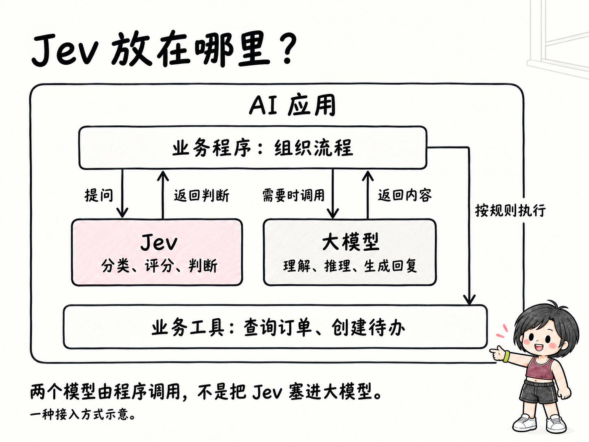
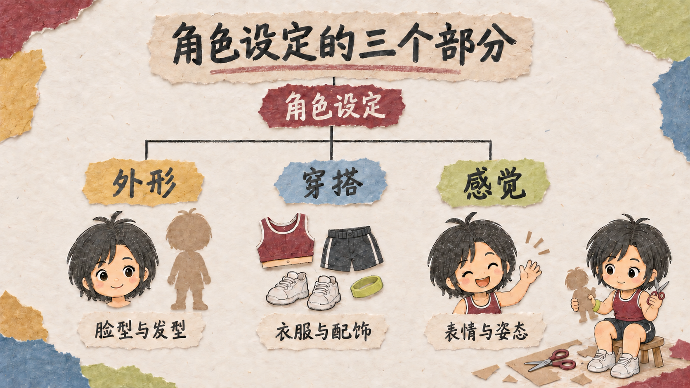
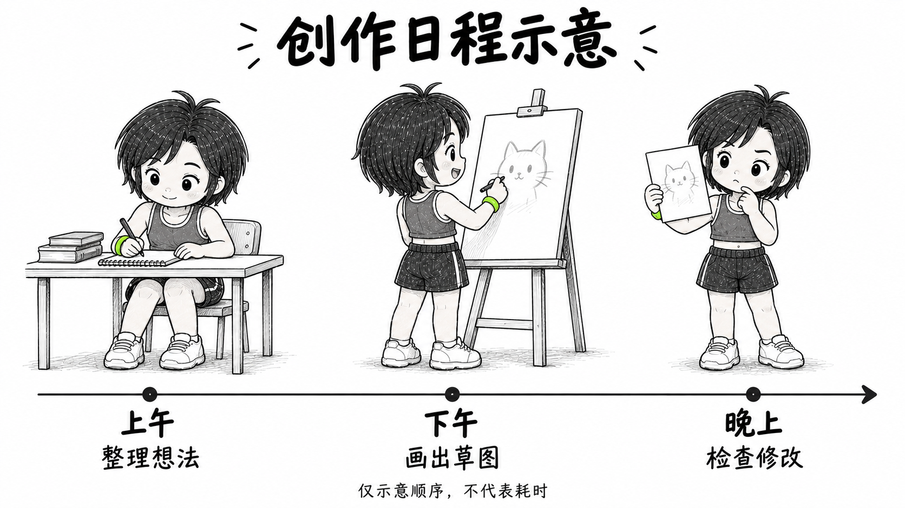
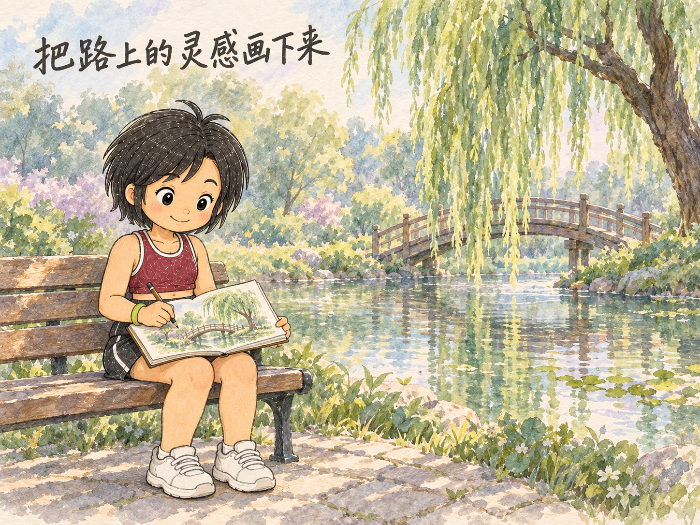

# Bela Hand Comic · 手绘连环画

把不容易讲清楚的主题，画成简约知识卡、手绘故事或图表。

我把自己做手绘图时用的角色参考、画风要求和检查步骤整理成了这个 Skill。故事场景默认采用彩铅线条、淡水彩和暖色纸张；知识解释可用淡背景的简约卡片。适合做概念解释、生活故事、课程配图，也可以给自己的角色画一组连续插画。

**人物可以换，画风和排版也能自己定。** 阿朱、阿兔和贝拉是随包提供的示例，你可以用自己的原创角色、上传参考图，或直接描述想法。一组图开始前确定设定，后面再保持连贯。

[适用 Agent](#可以装到哪些-agent) · [复制安装](INSTALL.md) · [统一图库与提示词](docs/diagram-demos.md) · [看图片与截图](docs/screenshots.md) · [使用与自定义](docs/usage.md) · [提示词参考](docs/prompt-examples.md) · [验证范围](TESTING.md)

## 先选表达方式，再选画风

**简约知识卡和故事场景，是两种信息组织方式；墨线、蜡笔、剪纸、水彩，是可以搭配的画风。** 流程图、对比表、结构图和时间线则说明内容如何排列，它们都属于同一个 Skill。

| 先决定什么 | 怎么选 |
|---|---|
| 表达方式 | 讲定义、流程和比较，优先简约知识卡；讲人物行动、生活和情绪，选故事场景 |
| 图的类型 | 步骤用流程图，异同用对比表，组成用结构图，先后用时间线；具体动作也可以只画一个场景 |
| 画风与角色 | 再选白底墨线、粗蜡笔、剪纸拼贴或彩铅水彩，并提供自己的角色参考；示例贝拉、阿朱和阿兔都可替换 |

简约版保留关键解释、必要例子和少量有色场景，减少碎装饰、多层强调和重复对白。它可以有清楚的流程图与多条短标签，也不要求所有画面都变成纯文字白板。[完整规则](references/simple-knowledge-card.md)

## 统一效果图库

以下都是实际生成并检查过的图片。简约卡复用作者已有 JEV 系列成图；其他示例展示不同材质与用途。**旧风格示例保留原貌，并不全部符合简约版的装饰密度要求。** 点击图片查看原图，每种的用途、输入要求和提示词见 [完整图库说明](docs/diagram-demos.md)。

<table>
<tr>
<td width="50%"><a href="docs/images/demo-simple-knowledge-card.png"><br><b>简约知识卡 · 应用结构示意</b></a><br>先看关系，淡背景与小人物辅助阅读。</td>
<td width="50%"><a href="docs/images/demo-flowchart.png"><br><b>白底墨线 · 流程图</b></a><br>说明步骤、判断和返工。</td>
</tr>
<tr>
<td width="50%"><a href="docs/images/demo-comparison.png"><br><b>粗蜡笔 · 对比表</b></a><br>用统一维度比较资料要求。</td>
<td width="50%"><a href="docs/images/demo-collage-structure.png"><br><b>剪纸拼贴 · 结构图</b></a><br>用纸片分组表现组成关系。</td>
</tr>
<tr>
<td width="50%"><a href="docs/images/demo-ink-timeline.png"><br><b>黑白漫画 · 时间线</b></a><br>串联阶段，青柠手环点色。</td>
<td width="50%"><a href="docs/images/demo-watercolor-journal.png"><br><b>水彩手账 · 生活场景</b></a><br>用环境与动作表达观察和情绪。</td>
</tr>
</table>

[放大看图、复制请求与了解搭配](docs/diagram-demos.md) · [原有彩铅故事与角色参考](docs/screenshots.md) · [生成与检查记录](TESTING.md)

图库是视觉示例，不是软件操作截图，也不保证任意组合一次生成成功。JEV 卡片只展示一种应用接法，不是安装本 Skill 所需的依赖；真实数值图表仍须用可计算工具保证数据位置和比例。

## 可以装到哪些 Agent

**支持通过 Skills 安装器安装到 Claude Code、Codex、Cursor、OpenCode、Gemini CLI 和 GitHub Copilot。** 这些工具可以使用本仓库的 Skill 文件；是否能直接出图，取决于当前 Agent 接入的图片工具。

| Agent | 安装参数 | 当前验证范围 |
|---|---|---|
| Claude Code | `--agent claude-code` | 项目级文件安装已验证 |
| Codex | `--agent codex` | 项目级文件安装已验证 |
| Cursor | `--agent cursor` | 项目级文件安装已验证 |
| OpenCode | `--agent opencode` | 项目级文件安装已验证 |
| Gemini CLI | `--agent gemini-cli` | 项目级文件安装已验证 |
| GitHub Copilot | `--agent github-copilot` | 项目级文件安装已验证 |

本次验证了安装器向六种目标部署文件，部分 Agent 共用同一安装目录；没有逐一启动这些客户端验证加载、触发或完整出图，GitHub Copilot 的具体客户端入口也需按其文档确认。

写故事、分镜和提示词需要文字模型与文件读取能力；生成图片还需要能传入参考图的图片工具，定点改图还需要图片编辑能力。**能安装 Skill，不代表自动获得图片模型或生成额度。** Claude Code 等环境可以通过其支持的工具、MCP 或 API 接入图片服务，实际可用性要在当前环境检查。

安装目标按 [Skills 官方支持列表](https://github.com/vercel-labs/skills#supported-agents) 核验；[各 Agent 的安装命令](INSTALL.md#用命令安装) 和 [实际验证记录](TESTING.md) 单独列出。其他 Agent 先检查当前安装器和客户端文档，不笼统承诺全部兼容。

## 一句话安装

把下面整段发给能管理本地文件、支持 Skill 的 AI 助手：

```text
请帮我安装 Bela Hand Comic 手绘连环画 Skill：
https://github.com/belalee-ai/bela-hand-comic

按当前工具支持的方式安装完整仓库里的 Skill。
保留 assets、references、scripts 和 agents。
装好后检查能否读取角色参考图，以及是否具备图片生成、参考图输入和编辑能力。
如果只能写文字，先说明限制，不把提示词当成已经出图。
```

习惯用终端的话，复制这条，再选择你用的工具：

```sh
npx skills add belalee-ai/bela-hand-comic --skill bela-hand-comic --global
```

命令使用 [Vercel Skills 安装工具](https://github.com/vercel-labs/skills)，需要 Node.js/npm、Git 和网络。[各 Agent 专用命令及备用安装方式](INSTALL.md)

## 装好后，先这样试一次

```text
使用 bela-hand-comic，先检查参考图和出图能力。
我想画一张“小兔和小猪一起准备野餐”的手绘图，横版 4:3。
沿用随包示例角色，画面文字是“我们一起准备野餐”。
先说清构图，再生成一张，检查文字和人物是否一致。
```

支持 `$` 调用的工具中也可以写 `$bela-hand-comic`。输入给 AI 助手，不是粘到终端里运行。

## 还没有自己的角色，要准备什么

**有照片可以照着设计，没有照片也可以从文字开始。** 先告诉助手五件事：角色是谁、最明显的外形特点、常穿什么、给人的感觉、准备用在哪里。

| 你想做什么 | 可以提供的材料 |
|---|---|
| 把自己变成手绘角色 | 一张清楚的照片，加上想保留的特征、穿搭和画风；在意全身造型时补全身照 |
| 延续自己的原创角色 | 已有角色图，注明不能改变的细节 |
| 从零设计新人物或小动物 | 文字描述外形、衣服、性格感觉和用途；没想好的地方可让助手建议 |
| 换一种画风 | 风格参考图或文字说明，标明只参考笔触、配色还是比例 |

资料发给你正在使用的 AI 助手，不用传到 GitHub。先确认一张人物形象图，再补侧面、背面和常用动作；确认后用角色图和文字设定制作故事。

[查看完整角色设计指南：材料要求、可填写模板、填写示例与确认步骤](docs/character-design.md)

## 哪些地方可以自己改

| 你想改什么 | 可以直接怎么说 |
|---|---|
| 人物 | “换成我上传的短发女孩和橘猫，保持这张参考图的衣服。” |
| 画风 | “保留手绘感，换成粗蜡笔线条，少一点水彩。” |
| 配色和背景 | “用蓝白配色，纸张留白多一些。” |
| 排版 | “改成竖版 3:4，文字在上面，人物在下面。” |
| 故事节奏 | “一张只讲一个动作，张数按内容需要来。” |
| 文字 | “只放我给的这句话，不要额外加标题。” |
| 已有图片 | “只改这一处文字，其他地方保持原样。” |

自定义的是这次作品的设定。角色确定后，同一套图保持身份、服装和重要配饰一致，动作与表情可以变化。阿朱、阿兔和贝拉都可以替换；贝拉是作者个人 IP，不会默认成为你的本人替身。

## 它怎么把一件事画清楚

先确定主题与样式 → 检查已有素材 → 理清事情的前后关系 → 拆成每页内容 → 做一张关键示例 → 确认后逐张出图 → 检查文字、角色和逻辑。

流程图、对比表、结构图和时间线先列清节点、条目与关系，再选版式出图，检查箭头、行列和标签。真实数据图表还要核对数据、单位和比例。

复杂的概念绘本会先让你看逐页内容和关键示例。单张小图或局部修改只处理相关部分，不必重新走完整套流程。

## 需要什么环境

| 环节 | 需要什么 |
|---|---|
| 安装 | 支持 Skill、能读写本地文件的 AI 助手；用上面的终端命令还需要 Node.js/npm 和 Git |
| 写故事和分镜 | 可用的文字模型，能读取你的材料和本 Skill |
| 生成新图 | 助手能调用图片生成工具，并把参考图传给它；文字模型能看图不等于能把图传给生成工具 |
| 修改已有图 | 图片编辑能力，能接收现有成片作为编辑目标 |
| 精确数据图表，可选 | 原始数据及来源；可运行 Matplotlib、Vega-Lite 或其他确定性绘图工具的环境，依所选工具安装依赖 |
| 七图拼版，可选 | Bash 和 FFmpeg；不需要重新调用图片模型 |
| 查看 PNG 成品 | 普通图片查看器或浏览器 |

Skill 提供方法、参考素材和一个拼版脚本；模型、账号和生成额度由你使用的工具提供。只会聊天的网页可以参考说明，但不一定能安装或完成出图。安装器支持某个客户端，也不代表该客户端已经具备图片生成能力。

macOS 已做本次文件与拼版检查；Windows、Linux 和不同助手的完整出图流程还没有逐一验证。[详细环境、费用与排错说明](INSTALL.md)

## 最后会拿到什么

一套主题说明、逐张图片，以及按需要生成的组合图。默认文件结构如下，也可以按你的要求调整：

```text
我的主题/
├── 主题说明.md
└── 图片/
    ├── 01-任务出现.png
    ├── 02-开始准备.png
    └── 03-一起完成.png
```

默认单幅 4:3，多图总览 3:4。随包脚本只实现“七张图拼成 1536×2048 竖图”这一种布局；其他张数和版式需要另外安排。图片生成仍可能出现错字、配饰错位和动作不连贯，需要逐张检查。

## 文件与来源

- [SKILL.md](SKILL.md)：助手的执行步骤，支持自定义人物和样式。
- [风格指南](references/style-guide.md)：默认手绘规则、示例人物与提示词模板。
- [简约知识卡规则](references/simple-knowledge-card.md)：信息层次、场景取舍和人物配饰检查。
- [图示规则](references/diagrams-and-charts.md)：流程、对比、结构、时间与数值图表的制作和检查。
- [Demo 与提示词](docs/diagram-demos.md)：流程、对比、结构、时间线与场景示例，含贝拉 IP。
- [assets](assets)：7 张随包提供的角色与画风参考。
- [拼版脚本](scripts/compose-seven-3x4.sh)：组合已确认图片，不重绘图片内容。

assets 中的参考图来自作者已有的手绘工作流素材；docs/images/demo- 开头的图片包括本次生成的风格示例和复用的 JEV 简约卡，README 的真实页面截图另行标注。白底解释图的展示方向参考了 [Ian 的插画项目](https://github.com/helloianneo/ian-xiaohei-illustrations)，本仓库新图使用贝拉参考重新生成，未搬用其图片或小黑角色。项目没有附带模型、第三方账号或私人对话。当前未附开源许可证；如需转载素材或商用角色，请先与作者确认，勿将贝拉用作作者背书。
