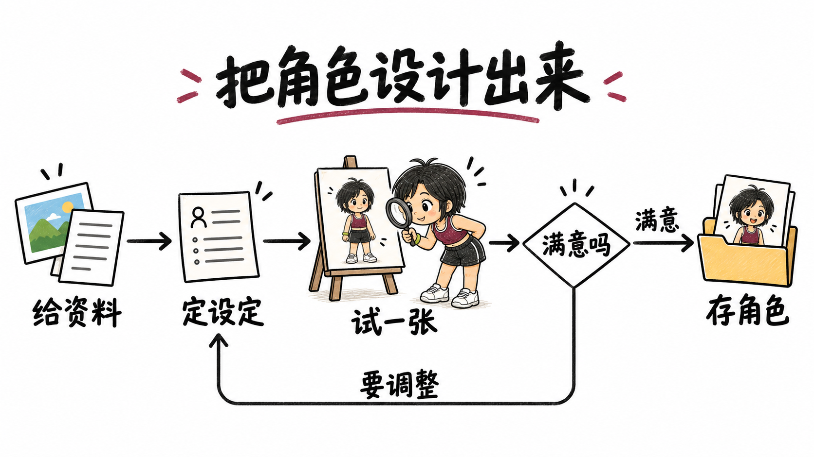
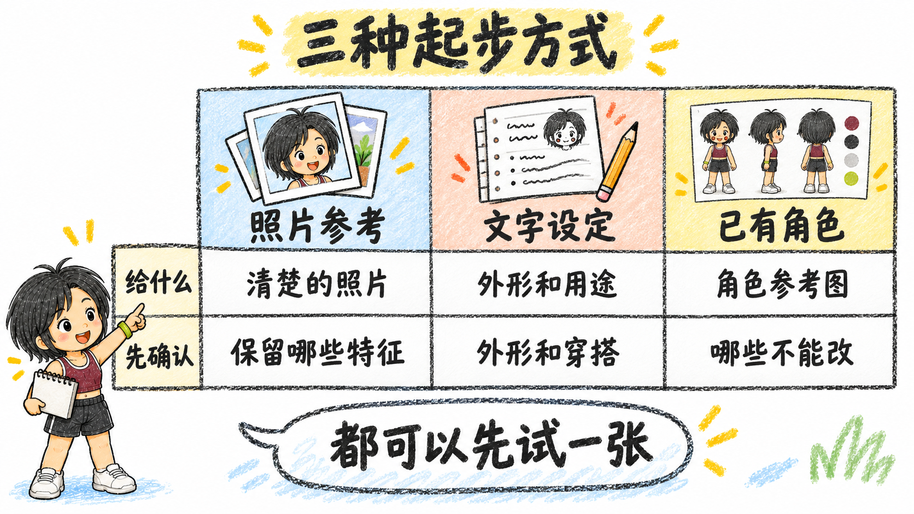
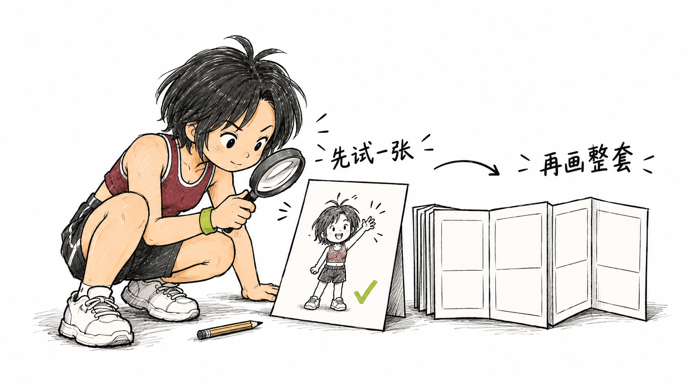

# 手绘图示 Demo：贝拉一起讲清楚

2026-09-21，使用本 Skill 整理内容与检查关系，在 Codex 中用内置图片工具生成。下面前两张是本次新增 Demo，最后一张是此前确认的白底风格试样。图片是方法示意，不是软件操作截图。

## 1. 白底墨线流程图



适合讲步骤、判断和返工。先核对“从哪里开始、什么条件进入下一步、哪里需要重做”，再画箭头。贝拉参与检查，让动作服务于流程。

复制给支持图片生成的助手：

```text
使用 bela-hand-comic，参考随包 assets/bela-character-reference.png 中的贝拉 IP。
画一张横版 16:9 白底墨线手绘流程图，标题“把角色设计出来”。
从左到右：给资料 → 定设定 → 试一张 → 满意吗。
“满意”通向“存角色”；“要调整”从下方回到“定设定”。
贝拉在“试一张”旁用放大镜检查样稿，不能挡字或箭头。
黑色线条，少量彩色点缀；只写指定文字，逐条检查方向和中文。
```

## 2. 粗蜡笔对比表



适合并排说明选项。三列使用同一组维度，读者可以横向比较；图中没有评分，也不暗示哪一种更好。贝拉在表外指引，信息保持完整。

```text
使用 bela-hand-comic，沿用随包贝拉角色参考，画横版 16:9 手绘对比表。
标题“三种起步方式”，画风是粗蜡笔，少量蓝、桃色、黄色纸片质感。
三列：照片参考 / 文字设定 / 已有角色。
第一行“给什么”：清楚的照片 / 外形和用途 / 角色参考图。
第二行“先确认”：保留哪些特征 / 外形和穿搭 / 哪些不能改。
贝拉站在表格外指引，气泡写“都可以先试一张”。
列宽一致、行对齐、字要清楚；不加评分，不遮挡内容。
```

## 角色与风格怎么换

这两张都用了作者的贝拉 IP。可参考 [贝拉人物设定图](../assets/bela-character-reference.png)，保留黑色短发、酒红运动背心、炭黑短裤与青柠配饰等识别点，再按场景安排动作。需要严格保持配饰位置等细节时，逐张对照设定图验收；生成示例不能作为修改原始设定的依据。

使用自己的角色时，把提示词中的“贝拉角色参考”换成你提供的角色图，说明必须保留的外形、服装、配饰和允许改变的部分。没有现成图也可以从文字或照片起步，见 [角色设计指南](character-design.md)。资料发给正在使用的助手，无需公开到 GitHub。

画风、配色、字体、画幅和排版也可以替换。Skill 负责组织要求和检查，不附带图片模型；Claude Code、Codex 等环境都还需要可用的图片工具与参考图输入能力。详见 [安装与环境](../INSTALL.md)。

## 3. 已确认的白底风格试样



它用“检查一张样稿，再做整套”的动作解释工作方法，采用白底、黑色线条与少量点色。不是流程图，也不应把空白分镜解释成已完成的作品。

## 有数据的图怎么办

流程和定性对比可以用图片模型生成。真实数字的柱状图、折线图、占比图，必须提供数据、单位、时间范围与来源，使用可计算的绘图工具绘制几何位置和标签。贝拉可以作为独立插画放在图表旁边，避免重绘或遮挡数据。具体见 [图示与数据规则](../references/diagrams-and-charts.md)。

[完整生成提示词](demo-generation-prompts.md) · [实际验证范围](../TESTING.md)

白底解释图的展示方向参考了 [Ian 的插画项目](https://github.com/helloianneo/ian-xiaohei-illustrations)。本页图片使用贝拉参考重新生成，未搬用该项目原图、小黑角色或示例构图；人物仍可由使用者自定义。
