# 图片与截图参考

这里分为“随包手绘参考图”和“实际仓库页面截图”。参考图用于看人物、笔触和布局；页面截图用于看说明与安装入口。它们不能证明任意客户端都已完成生图实测。

## 默认手绘场景

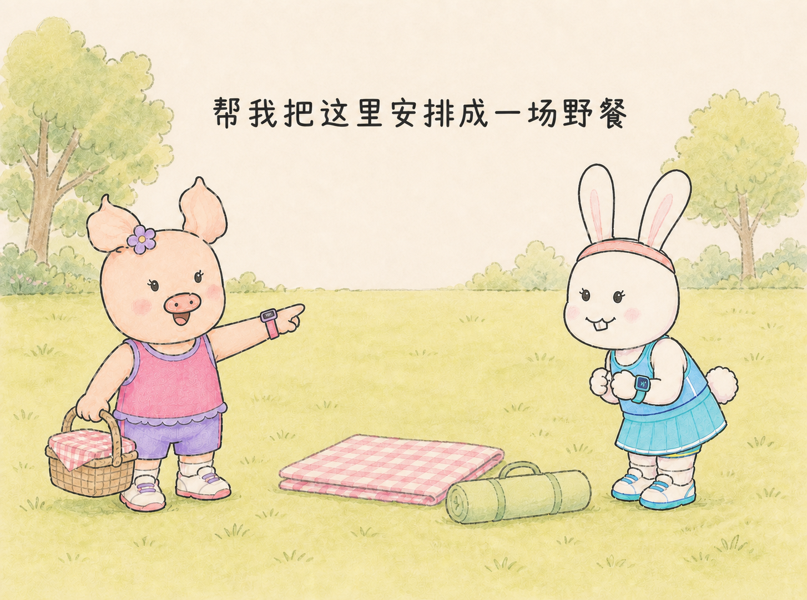

适合一页一个动作：画面上方留一句话，人物在下方，用少量道具交代发生了什么。人物、背景、字的位置和画幅都可调整。

## 动作与概念

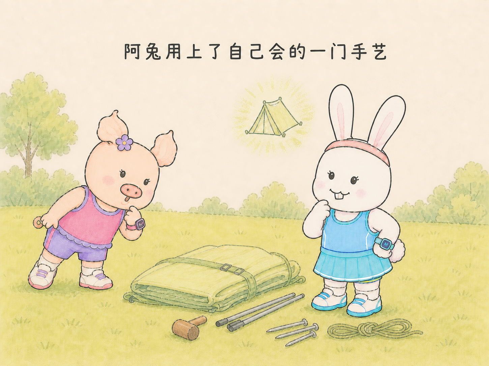

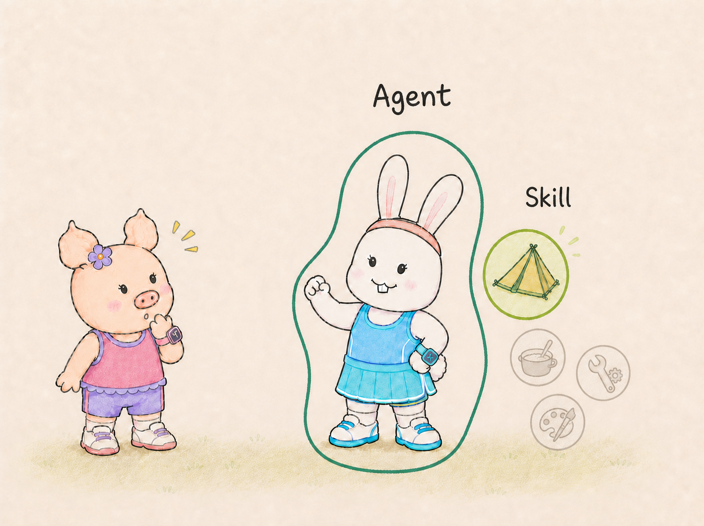

两张图使用同一组人物与笔触。概念图是生活比喻，帐篷图标表示搭帐篷的本领，不是实际软件架构截图。

## 示例角色也可以换

### 阿朱

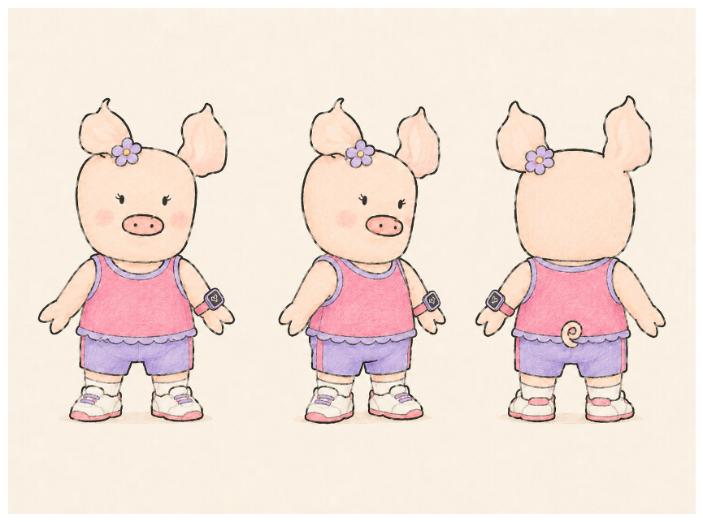

### 阿兔

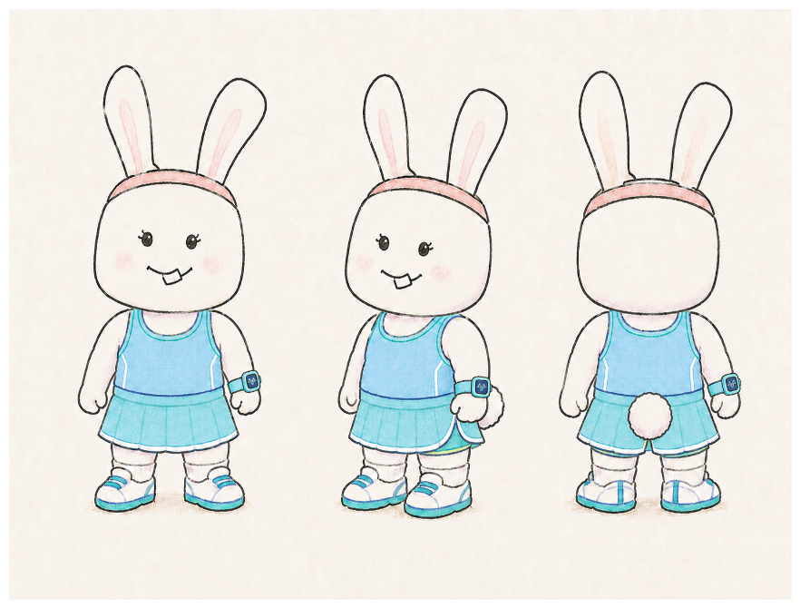

### 贝拉

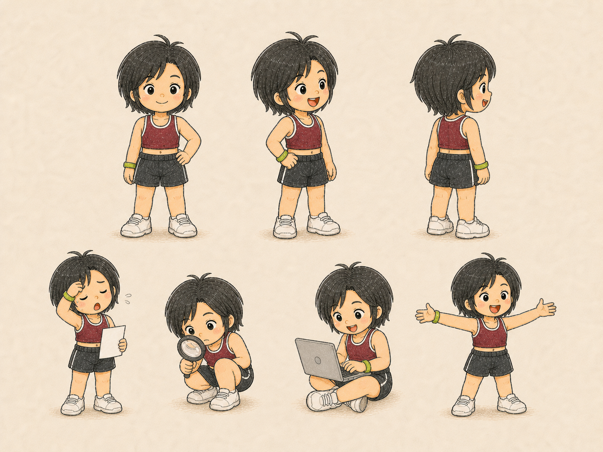

这些是作者已有角色。你可以换自己的原创人物、小动物、服装和配饰；先确认本次设定，再保持同一套图的连续性。贝拉是作者个人 IP，不默认代表其他使用者。

### 手写字样式

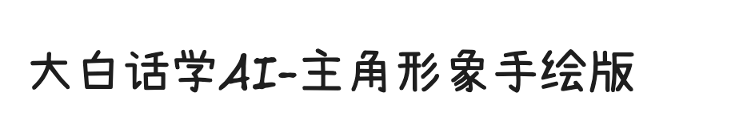

这是图片形式的笔迹参考，不是可安装的字体文件。实际生成文字仍需逐字检查。

## 实际仓库页面截图

拍摄于 2026-09-21，浏览器视口 1440×1080。下面前三张来自本仓库 README 提交 `b598352`，记录当时的默认效果、安装与自定义说明；新增的 Agent 兼容截图来自提交 `f897f62`。截图只记录文档显示，不是图片生成过程；最新能力和命令以当前 README、INSTALL 为准。

### 默认效果与可自定义说明

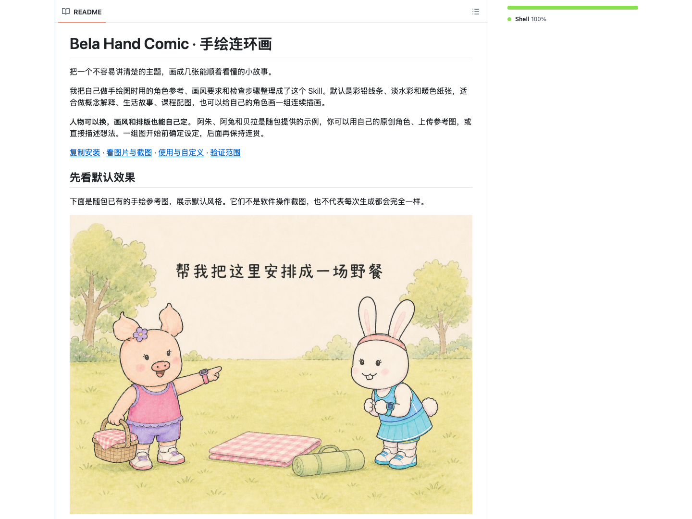

### 安装与第一次使用

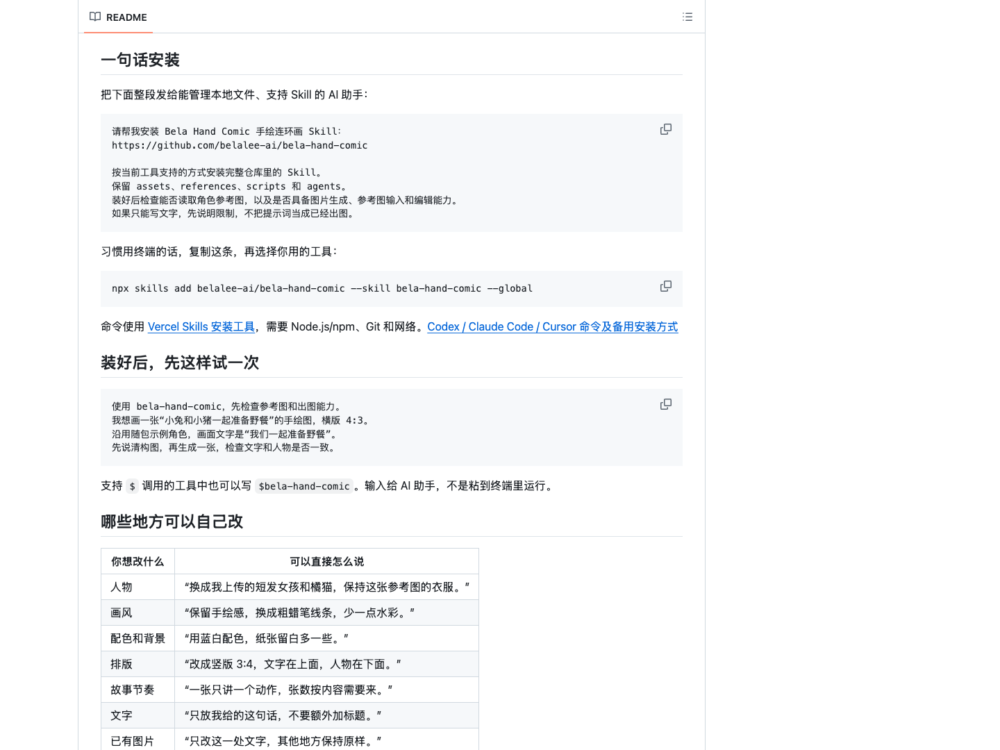

### 自定义与环境要求

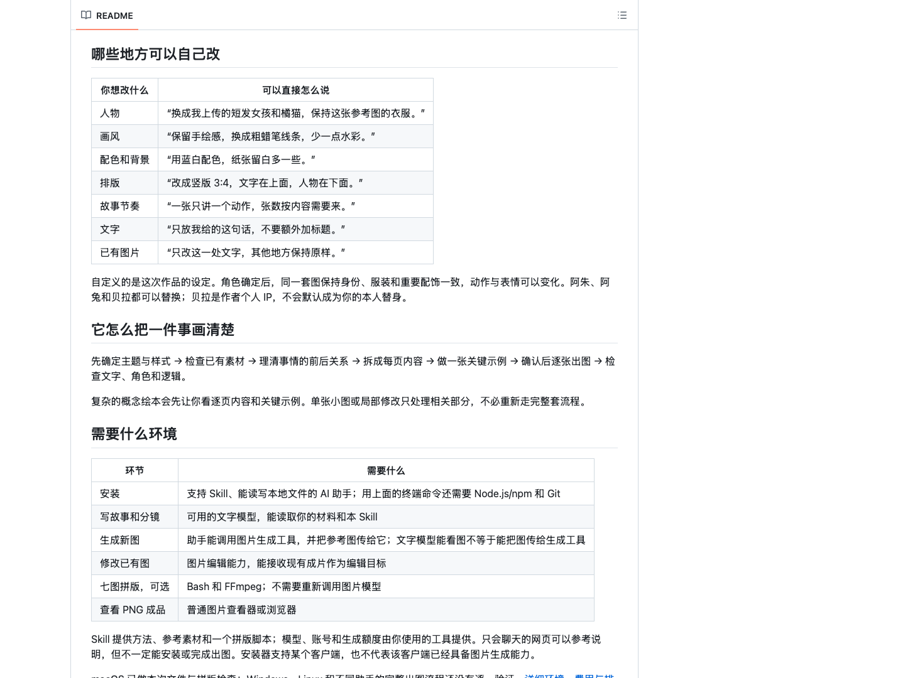

### Agent 兼容说明

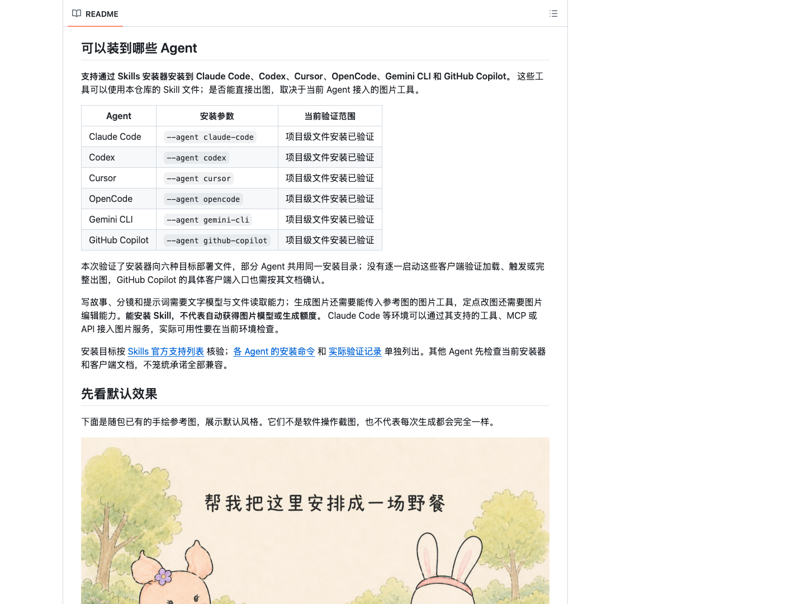

安装支持、项目级文件验证与客户端完整出图分别说明；Claude Code、Codex 等工具名直接放在首页。

### 从材料到角色设计

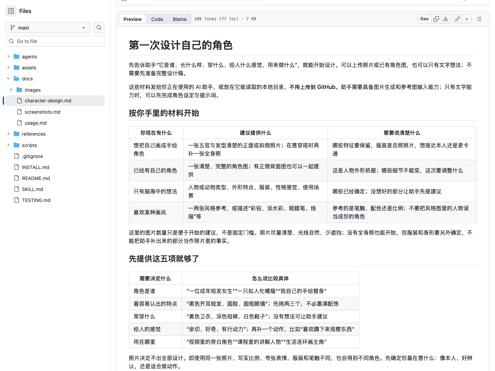

拍摄于 2026-09-21，来自 `docs/character-design.md`（提交 `c5b1201`），视口 1440×1080。展示照片、角色图、纯文字和风格参考分别需要提供什么；完整可填写模板见 [角色设计指南](character-design.md)。
